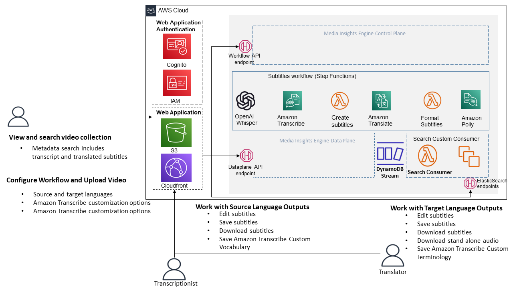

# Modified Content Localization on AWS 

Welcome to the Modified Content Localization on AWS project! This project will help you extend the reach of your VOD content by quickly and efficiently creating accurate multi-language subtitles using AWS AI Services.  You can make manual corrections to the automatically created subtitles and use advanced AWS AI Service customization features to improve the results of the automation for your content domain. Content Localization is built on [Modified Media Insights Engine (MIE)](https://github.com/zeroandoneme/media-insights-on-aws-modified.git), a framework that helps accelerate the development of serverless applications that process video, images, audio, and text with artificial intelligence services and multimedia services on AWS.

The modified version of the Content Localization on AWS project provides significant improvement to the original AWS solution by enabling the workflow to be run based on an subtitle file only. This modification greatly streamlines the process of creating multi-language subtitles, resulting in a significant reduction of both time and cost by up to 70% from the initial solution {in the previouis solution you were forced to have the video as well}.

Localization is the process of taking video content that was created for audiences in one geography and transforming it to make it relevant and accessible to audiences in a new geography.  Creating alternative language subtitle tracks is central to the localization process.  This application presents a guided experience for automatically generating and correcting subtitles for videos in multiple languages using AWS AI Services.  The corrections made by editors can be used to customize the results of AWS AI services for future workflows.  This type of AI/ML workflow, which incorporates user corrections is often referred to as “human in the loop”.

Content Localization workflows can make use of advanced customization features provided by Amazon Transcribe and Amazon Translate:

* [Amazon Transcribe Custom Vocabulary](https://docs.aws.amazon.com/transcribe/latest/dg/how-vocabulary.html) - you provide Amazon Transcribe with a list of terms that are specific to your content and how you want the terms to be displayed in transcipts
* [Amazon Transcribe Custom Language Models](https://docs.aws.amazon.com/transcribe/latest/dg/custom-language-models.html) - you provide Amazon Transcribe with domain-specific text data that is representative of the audio you want to transcribe. 
* [Amazon Translate Custom Terminologies](https://docs.aws.amazon.com/translate/latest/dg/how-custom-terminology.html) - you provide Amazon Translate with a list of terms or phrases in the source language content and specify how you want them to appear in the translated result.
* [Amazon Translate Parallel Data for Active Custom Translation](https://docs.aws.amazon.com/translate/latest/dg/customizing-translations-parallel-data.html) - you provide Amazon Translate with a list of parallel phrases: the source language and the pharase tranlated the way you want it.  The Parallel Data customizes Amazon Translate models so they create more contectual translations based on the sample you provide.

Application users can manually correct the results of the automation at different points in the automated workflow and then trigger a new workflow to inclue their corrections in downstream processing.  Corrections are tracked and can be used to update Amazon Transcribe Custom Vocabularies and Amazon Translate Custom Terminologies to improve future results.  

### Why use customizations and human-in-the-loop?

Automating the creation of translated subtitles using AI/ML promises to speed up the process of localization for your content, but there are still challenges to acheive the level of accuracy that is required for specific use cases.  With natural language processing, many aspects of the content itself may determine the level of accuracy AI/ML analysis is capable of achieving.  Some content characteristics that can impact transcription and translation accuracy include: domain specific language, speaker accents and dialects, new words recently introduced to common language, the need for contextual interpretation of ambiguous phases, and correct translation of proper names.   AWS AI services provide a variety of features to help customize the results of the machine learning to specific content.   Therefore, the workflow in this application seeks to provide users with a guided experience to use these customization features as an extension of their normal editing workflow.

### Doesn’t content localization involve more than just subtitles?

As a first step, this project seeks to create an efficient, customizable workflow for creating multi-language subtitles.  We hope that this project will grow to apply AWS more AI Services to help automate other parts of the localization process.  For this reason, the application workflow includes the options to generate other useful types of analysis available in AWS AI Services.  While this analysis is not performed in the base workflow, developers can enable it to explore the available data to help with extending the application.  Here are some ideas to inspire the builders out there to extend this application:

* Identifying names of people within the collection and auto-suggesting or correcting them in subtitiles.  People may be identified using voice recognition with Amazon Transcribe, or with Amazon Rekognition Celebrity Recognition, or Face  Search.
* Identify text or phrases in the visual content that may need to be translated.
* Use shot boundary and location of visual artifacts withing the content to help with placement of subtitles within relative to the content.

# Deployment

The following Cloudformation templates will deploy the Content Localization front-end application with a prebuilt version of the most recent MIE release.

Region| Launch
------|-----
US West (Oregon) | 
EU West (Ireland) | 

